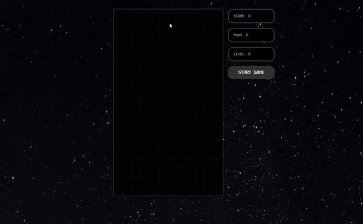

# Tetris Game

## 🖊Description
This repository contains a fun Tetris Game with the old simple and nostalgic Tetris interface. The credits goes to Thomas Weibenfalk since most part of this application was developed by following tutorial his tutorial on freeCodeCamp.org YouTube channel.

<p align="center">
  
</p>

## 💻Technologies
This game was developed using React.JS, Styled Components and a lot of React and Customized Hooks.

## 🕹How to Start

### Clone the repository
```bash
git clone https://github.com/weilemann/Tetris.git
```

### Install dependencies
```bash
yarn
```
or
```bash
npm install
```

### Run the code
```bash
yarn start
```
or
```bash
npm start
```

### And done! 🎉
Now you can have extra dosis of nostalgia by playing the simple and incomparably fun game! Have fun! 🙂

## 🎮Controls
<kbd>W</kbd> or <kbd>Up</kbd> - Rotate Tetromino

<kbd>D</kbd> or <kbd>Right</kbd> - Move Tetromino to Right

<kbd>A</kbd> or <kbd>Left</kbd> - Move Tetromino to Left

<kbd>S</kbd> or <kbd>Down</kbd> - Drop Tetromino (keep pressed)

## 📜License
This game was developed under the MIT License.
